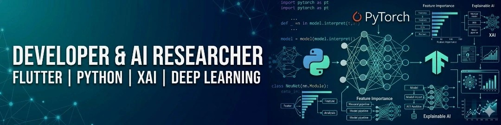

  

 

  

  
    
  
  
  
  
   

  

    

      
    

     
    
     
    
  

   
  
  
  
  
  
  
  

  

    

      
    

     
    <table border="0" width="100%">
      <tr>
        <td width="50%" align="center" valign="top">
          <h3>🥇 Outstanding Research Award</h3>
          
<i>Recognized for high-precision Biomedical AI</i>

          
        </td>
        <td width="50%" align="center" valign="top">
          <h3>🏅 Cloud Deployment Mastery</h3>
          
<i>Multilingual AI App Deployment (SUVI & HCL)</i>

          
        </td>
      </tr>
      <tr>
        <td width="50%" align="center" valign="top">
           
          <h3>🚀 Top Tier Engineering Intern</h3>
          
<i>Enterprise-level Backend Routing</i>

          
        </td>
        <td width="50%" align="center" valign="top">
           
          <h3>🎓 Academic Excellence (2024)</h3>
          
<i>Top-percentile standing & XAI research</i>

          
        </td>
      </tr>
    </table>
  

  

## 🟣 [ IDENT.MATRIX: USER_PROFILE ]

<table border="0" width="100%">
  <tr>
    <td width="28%" align="center" valign="top">
      
    </td>
  <td width="72%" valign="top">
      <h3>>_ Faisal Ahmmed // Full-Stack Software Engineer</h3>
      
<b>ACTIVE.MODULES: [Web Development] [App Development] [AI Research] [Python/Flutter]</b>

      
Operating at the precise intersection of advanced artificial intelligence, cross-platform app development, and robust web architecture. With over three years of rigorous R&D and production experience, I architect the bridge between complex machine learning algorithms and high-performance, human-centric design.

      
Whether I am building scalable web applications, deploying seamless Flutter mobile apps, or engineering Explainable AI (XAI) systems, I deliver production-ready code that meets elite engineering standards. Capable of executing end-to-end cloud-backed infrastructure from the ground up.

    </td>
  </tr>
</table>

  

## 💠 [ SYS.TELEMETRY: THE TECHNICAL ARSENAL ]

<table border="0" width="100%">
  <tr>
    <td width="55%" valign="top" align="center">
      <h3>Deep Learning & AI</h3>
      
        
      <h3>Web & Cross-Platform Apps</h3>
      
    </td>
    <td width="45%" valign="top">
      <h3>>_ CORE_CAPABILITIES</h3>
      <code>[SYS.WEB_DEV]      ██████████████████░░ 90%</code> 
      <code>[LANG.PYTHON]      █████████████████░░░ 85%</code> 
      <code>[TECH.AI_MODELS]   ████████████████░░░░ 80%</code> 
      <code>[SYS.BACKEND]      ███████████████░░░░░ 75%</code> 
      <code>[DATA.RESEARCH]    ██████████████░░░░░░ 70%</code> 
      <code>[FRAME.FLUTTER]    ████████████░░░░░░░░ 60%</code>
    </td>
  </tr>
</table>

  

## 🔵 [ EXECUTION.GRID: OFFERINGS ]

<table border="0" cellpadding="0" cellspacing="0" width="100%">
  <tr>
    <td width="33%" valign="top">
      <h3>🌐 FULL-STACK WEB.DEV</h3>
      <ul>
        <li>Responsive frontend UI/UX</li>
        <li>Robust backend architecture</li>
        <li>Database design & APIs</li>
      </ul>
    </td>
    <td width="33%" valign="top">
      <h3>📱 CROSS-PLATFORM APPS</h3>
      <ul>
        <li>Flutter mobile engineering</li>
        <li>Seamless backend integration</li>
        <li>Accessible mobile AI toolsets</li>
      </ul>
    </td>
    <td width="33%" valign="top">
      <h3>🧠 AI & DEEP.LEARNING</h3>
      <ul>
        <li>Computer vision topologies</li>
        <li>Biomedical AI diagnostics</li>
        <li>Explainable AI (XAI)</li>
      </ul>
    </td>
  </tr>
  <tr>
    <td width="33%" valign="top">
       
      <h3>🏢 ENTERPRISE-GRADE WEB</h3>
      <ul>
        <li>Scalable microservices</li>
        <li>High-availability systems</li>
        <li>Secure payment routing</li>
      </ul>
    </td>
    <td width="33%" valign="top">
       
      <h3>⚙️ ENTERPRISE MOBILE APPS</h3>
      <ul>
        <li>Complex state management</li>
        <li>Offline-first architectures</li>
        <li>Native hardware integration</li>
      </ul>
    </td>
    <td width="33%" valign="top">
       
      <h3>☁️ CLOUD & DEVOPS</h3>
      <ul>
        <li>Automated CI/CD pipelines</li>
        <li>Docker & containerization</li>
        <li>AWS / GCP infrastructure</li>
      </ul>
    </td>
  </tr>
</table>

## 🚀 [ ARCHITECTURE.DEPLOYED: VISUAL MISSION LOGS ]

<table border="0" cellpadding="0" cellspacing="0" width="100%">
  <tr>
    <td width="50%" valign="top" align="center">
      
      <h3>> Full-Stack Web Platform</h3>
      
Architected and deployed a highly responsive, data-driven web application featuring seamless API integration and dynamic user routing.

      
      
    </td>
    <td width="50%" valign="top" align="center">
      
      <h3>> Cross-Platform Mobile App</h3>
      
Engineered a highly optimized Flutter application, bridging complex backend logic with an intuitive, 60fps mobile user interface.

      
      
    </td>
  </tr>
  <tr>
    <td width="50%" valign="top" align="center">
       
      
      <h3>> Retinal Pathology AI</h3>
      
End-to-end medical image analysis utilizing deep ensemble learning. Validated via custom K-Fold engine targeting Q1 publication standards.

      
      
    </td>
    <td width="50%" valign="top" align="center">
       
      
      <h3>> Enterprise Topology Sim</h3>
      
Multi-node network infrastructure simulation ensuring collision-free data flow across four distinct subnetworks via a central router.

      
      
    </td>
  </tr>
  <tr>
    <td width="50%" valign="top" align="center">
       
      
      <h3>> Scalable Microservices API</h3>
      
Engineered a highly available backend microservices architecture with automated container orchestration and secure data routing.

      
      
    </td>
    <td width="50%" valign="top" align="center">
       
      
      <h3>> Live Analytics Dashboard</h3>
      
Developed a real-time data ingestion and visualization engine processing high-throughput streams for immediate business intelligence.

      
      
    </td>
  </tr>
</table>

  

## 🟢 [ VALIDATION.LOGS: CLIENT_TESTIMONIALS ]

<table border="0" width="100%">
  <tr>
    <td width="50%" valign="top">
      <blockquote style="border-left: 4px solid #00E5FF; background-color: #0D1117; padding: 15px; border-radius: 0 8px 8px 0; border-top: 1px solid #30363D; border-right: 1px solid #30363D; border-bottom: 1px solid #30363D;">
        

 
        
        <i>"Faisal transformed our complex data into a stunning, intuitive UI. His brilliant visualizations created a flawless and highly engaging user experience."</i>  
        — <b>Alisha Patel</b> 
        <small>Senior Product Manager, Clinical UX</small>
      </blockquote>
    </td>
    <td width="50%" valign="top">
      <blockquote style="border-left: 4px solid #FF007F; background-color: #0D1117; padding: 15px; border-radius: 0 8px 8px 0; border-top: 1px solid #30363D; border-right: 1px solid #30363D; border-bottom: 1px solid #30363D;">
        

 
        
        <i>"One of the few engineers I've worked with who deeply understands both backend system architecture and the human psychology of front-end end users."</i>  
        — <b>Dr. E. Rahman</b> 
        <small>Lead AI Researcher & Systems Architect</small>
      </blockquote>
    </td>
  </tr>
  <tr>
    <td width="50%" valign="top">
      <blockquote style="border-left: 4px solid #FFD700; background-color: #0D1117; padding: 15px; border-radius: 0 8px 8px 0; border-top: 1px solid #30363D; border-right: 1px solid #30363D; border-bottom: 1px solid #30363D;">
        

 
        
        <i>"Exceptional problem-solving skills. Faisal didn't just build the app; he architected a scalable solution that drastically reduced our API latency."</i>  
        — <b>James D.</b> 
        <small>CTO, Tech Solutions Inc.</small>
      </blockquote>
    </td>
    <td width="50%" valign="top">
      <blockquote style="border-left: 4px solid #7000FF; background-color: #0D1117; padding: 15px; border-radius: 0 8px 8px 0; border-top: 1px solid #30363D; border-right: 1px solid #30363D; border-bottom: 1px solid #30363D;">
        

 
        
        <i>"A rare talent in machine learning. His ability to explain complex Deep Learning concepts and immediately deploy them into production is unmatched."</i>  
        — <b>Sarah K.</b> 
        <small>Data Science Director</small>
      </blockquote>
    </td>
  </tr>
</table>
## 📊 [ LIVE SYSTEM METRICS & ACTIVITY ]

  
  

   
  

   
  <b>[ AUTOMATED_CI/CD_CONTRIBUTION_GRAPH ]</b> 
  <picture>
    <source media="(prefers-color-scheme: dark)" srcset="https://raw.githubusercontent.com/faisalahmmed2236/faisalahmmed2236/output/github-contribution-grid-snake-dark.svg">
    <source media="(prefers-color-scheme: light)" srcset="https://raw.githubusercontent.com/faisalahmmed2236/faisalahmmed2236/output/github-contribution-grid-snake.svg">
    
  </picture>

  
## 🌐 ESTABLISH CONNECTION

  

  
  
  
  
  
   
  
   
  

